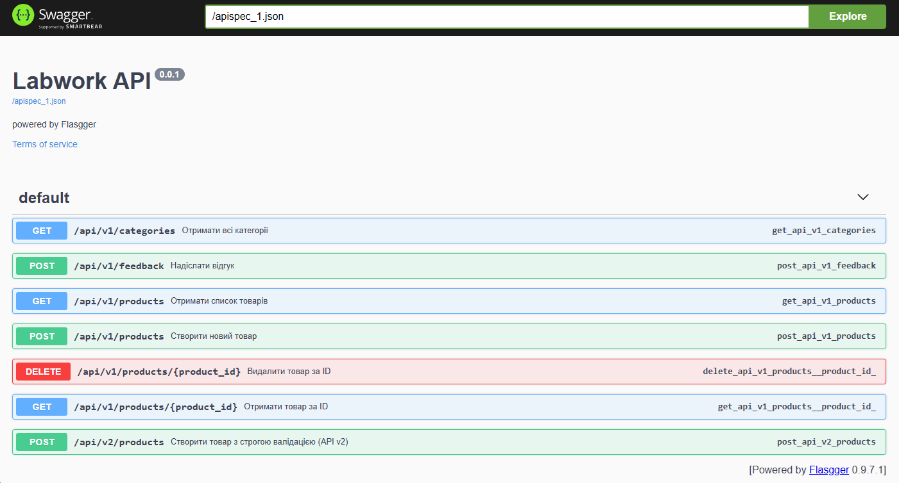
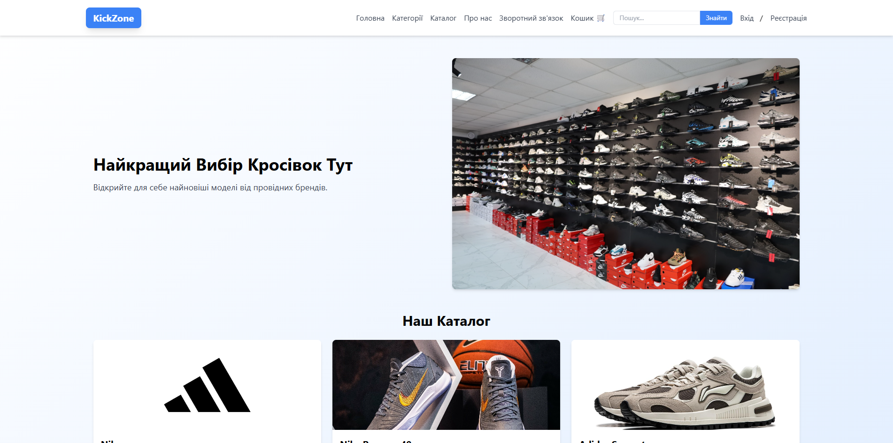
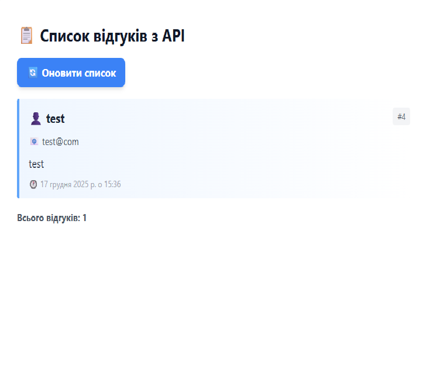
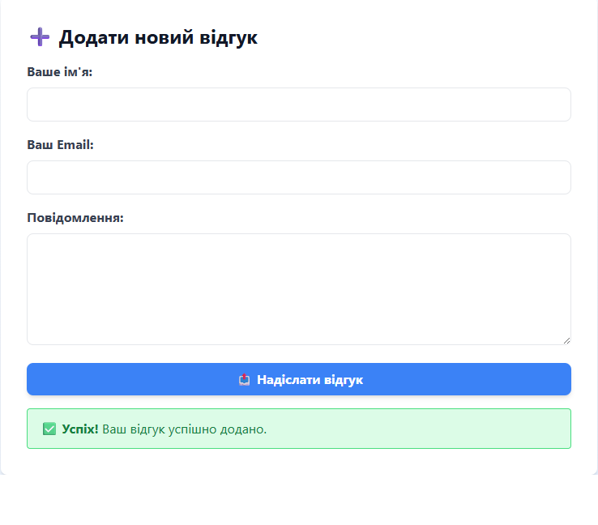

# Лабораторна робота №5: Розробка RESTful API

## Інформація про проєкт
- **Назва проєкту:** KickZone
- **Автори:** Бугайчук Д.П., Гринишин М.С., Гапяк М.В., Сюйва Д.Р.
- **Група:** ІПЗ-22

## Опис проєкту
REST API для інтернет-магазину кросівок з можливістю управління товарами, категоріями, відгуками користувачів та кошиком покупок. API підтримує JWT аутентифікацію, фільтрацію, пошук та повну CRUD функціональність.

## Технології
- Python 3.x
- Flask (веб-фреймворк)
- SQLite (база даних)
- Flask-JWT-Extended (JWT токени)
- Flasgger (Swagger документація)
- CORS middleware

## Endpoints API

### 1. Отримання списку всіх товарів
- **URL:** `/api/v1/products`
- **Метод:** `GET`
- **Опис:** Повертає список всіх товарів з можливістю фільтрації за категорією та пошуком
- **Параметри запиту:**
  - `category_id` (optional) - фільтр за категорією
  - `search` (optional) - пошук в назві або описі
- **Приклад запиту:**
```
GET /api/v1/products?category_id=1&search=Nike
```
- **Приклад відповіді:**
```json
[
  {
    "id": 1,
    "name": "Nike Air Max 90",
    "description": "Класичні кросівки для повсякденного носіння",
    "price": 3500,
    "image_url": "/static/uploads/nike-air-max.jpg",
    "category_id": 1,
    "category_name": "Спортивні"
  }
]
```

### 2. Отримання товару за ID
- **URL:** `/api/v1/products/{product_id}`
- **Метод:** `GET`
- **Опис:** Повертає детальну інформацію про конкретний товар
- **Приклад запиту:**
```
GET /api/v1/products/1
```
- **Приклад відповіді:**
```json
{
  "id": 1,
  "name": "Nike Air Max 90",
  "description": "Класичні кросівки для повсякденного носіння",
  "price": 3500,
  "image_url": "/static/uploads/nike-air-max.jpg",
  "category_id": 1,
  "category_name": "Спортивні"
}
```

### 3. Створення нового товару
- **URL:** `/api/v1/products`
- **Метод:** `POST`
- **Опис:** Створює новий товар (потребує JWT токен)
- **Заголовки:**
```
Authorization: Bearer <JWT_TOKEN>
Content-Type: application/json
```
- **Приклад запиту:**
```json
{
  "name": "Adidas Ultraboost",
  "description": "Комфортні бігові кросівки",
  "price": 4200,
  "image_url": "/static/uploads/adidas.jpg",
  "category_id": 1
}
```
- **Приклад відповіді:**
```json
{
  "message": "Product created successfully",
  "product_id": 5
}
```

### 4. Оновлення товару
- **URL:** `/api/v1/products/{product_id}`
- **Метод:** `PUT`
- **Опис:** Оновлює інформацію про існуючий товар (потребує JWT токен)
- **Заголовки:**
```
Authorization: Bearer <JWT_TOKEN>
Content-Type: application/json
```
- **Приклад запиту:**
```json
{
  "name": "Adidas Ultraboost 22",
  "price": 4500
}
```
- **Приклад відповіді:**
```json
{
  "message": "Product updated successfully"
}
```

### 5. Видалення товару
- **URL:** `/api/v1/products/{product_id}`
- **Метод:** `DELETE`
- **Опис:** Видаляє товар (потребує JWT токен)
- **Заголовки:**
```
Authorization: Bearer <JWT_TOKEN>
```
- **Приклад відповіді:**
```json
{
  "message": "Product deleted successfully"
}
```

### 6. Отримання списку категорій
- **URL:** `/api/v1/categories`
- **Метод:** `GET`
- **Опис:** Повертає всі доступні категорії товарів
- **Приклад відповіді:**
```json
[
  {
    "id": 1,
    "name": "Спортивні"
  },
  {
    "id": 2,
    "name": "Повсякденні"
  }
]
```

### 7. Отримання списку відгуків
- **URL:** `/api/feedback`
- **Метод:** `GET`
- **Опис:** Повертає всі відгуки користувачів
- **Приклад відповіді:**
```json
[
  {
    "id": 1,
    "user_name": "Іван Петренко",
    "email": "ivan@example.com",
    "message": "Чудовий магазин!",
    "created_at": "2025-12-17 14:30:00"
  }
]
```

### 8. Додавання відгуку
- **URL:** `/api/feedback`
- **Метод:** `POST`
- **Опис:** Створює новий відгук користувача
- **Тіло запиту (form-data):**
```
user_name: "Олексій Шевченко"
email: "oleksiy@example.com"
message: "Відмінний сервіс!"
```
- **Приклад відповіді:** Перенаправлення на головну сторінку (302)

### 9. Аутентифікація (отримання JWT токену)
- **URL:** `/api/auth/login`
- **Метод:** `POST`
- **Опис:** Авторизація користувача та отримання JWT токену
- **Приклад запиту:**
```json
{
  "username": "admin",
  "password": "password123"
}
```
- **Приклад відповіді:**
```json
{
  "access_token": "eyJ0eXAiOiJKV1QiLCJhbGc...",
  "username": "admin"
}
```
- **Скріншот з Postman (або Swagger):**



## Результати тестування в Postman

### Тестовий сценарій 1: Отримання списку товарів
- **Мета:** Перевірити коректність отримання всіх товарів
- **Запит:** `GET /api/v1/products`
- **Результат:** ✅ Успішно - отримано список з 4 товарів
- **Код відповіді:** 200 OK

### Тестовий сценарій 2: Пошук товарів за назвою
- **Мета:** Перевірити функціональність пошуку
- **Запит:** `GET /api/v1/products?search=Nike`
- **Результат:** ✅ Успішно - знайдено 2 товари Nike
- **Код відповіді:** 200 OK

### Тестовий сценарій 3: Створення товару без авторизації
- **Мета:** Перевірити захист endpoint'у від неавторизованого доступу
- **Запит:** `POST /api/v1/products` (без токену)
- **Результат:** ✅ Успішно - доступ заборонено
- **Код відповіді:** 401 Unauthorized

### Тестовий сценарій 4: Створення товару з авторизацією
- **Мета:** Перевірити створення нового товару
- **Запит:** `POST /api/v1/products` (з JWT токеном)
- **Результат:** ✅ Успішно - товар створено
- **Код відповіді:** 201 Created

### Тестовий сценарій 5: Отримання неіснуючого товару
- **Мета:** Перевірити обробку помилки 404
- **Запит:** `GET /api/v1/products/999`
- **Результат:** ✅ Успішно - повернуто помилку
- **Код відповіді:** 404 Not Found

### Тестовий сценарій 6: Отримання списку відгуків
- **Мета:** Перевірити API для відгуків
- **Запит:** `GET /api/feedback`
- **Результат:** ✅ Успішно - отримано список відгуків у форматі JSON
- **Код відповіді:** 200 OK

### Тестовий сценарій 7: Додавання відгуку
- **Мета:** Перевірити створення нового відгуку
- **Запит:** `POST /api/feedback` (form-data)
- **Результат:** ✅ Успішно - відгук збережено в БД
- **Код відповіді:** 302 Found (редірект)

## Обробка помилок
Список реалізованих кодів помилок:
- `400 Bad Request` - некоректні дані у запиті (відсутні обов'язкові поля)
- `401 Unauthorized` - відсутній або невалідний JWT токен
- `404 Not Found` - запитуваний ресурс (товар, категорія) не знайдено
- `409 Conflict` - конфлікт даних (наприклад, дублювання категорії)
- `500 Internal Server Error` - внутрішня помилка сервера

### Приклад відповіді з помилкою:
```json
{
  "error": "Product not found"
}
```

## Swagger/Flasgger документація
API документація доступна за адресою: `http://localhost:5000/apidocs`

Swagger UI надає інтерактивний інтерфейс для тестування всіх endpoints з автоматичною валідацією запитів та відповідей.

---


# Лабораторна робота 6

**Студент:** Бугайчук Д.П. Гринишин М.С. Гапяк М.В. Сюйва Д.Р.
**Група:** IПЗ-22 

## 📋 Опис проєкту

Веб-застосунок "Світ Кросівок" (KickZone) - це інтернет-магазин взуття з повнофункціональним API. Застосунок дозволяє переглядати каталог товарів, фільтрувати за категоріями, додавати товари до кошика, залишати відгуки та керувати контентом через адміністративну панель. API Demo сторінка демонструє роботу з REST API для управління відгуками через AJAX запити.

## 📁 Структура проєкту

```
labwork2-4/
├── app.py                    # Головний файл Flask додатку
├── models.py                 # Моделі бази даних та функції доступу
├── requirements.txt          # Залежності Python
├── db.sqlite                 # База даних SQLite
├── Dockerfile                # Docker конфігурація
├── docker-compose.yml        # Docker Compose для production
├── nginx.conf                # Конфігурація Nginx
├── API_README.md             # Документація API
├── README.md                 # Цей файл
├── routes/                   # Маршрути Flask
│   ├── __init__.py
│   ├── admin.py              # Адмін-панель
│   ├── api.py                # REST API endpoints
│   ├── api_demo.py           # API Demo сторінка
│   ├── auth.py               # Аутентифікація
│   ├── feedback.py           # Відгуки
│   └── shop.py               # Магазин
├── templates/                # HTML шаблони
│   ├── base.html             # Базовий шаблон
│   ├── home.html             # Головна сторінка
│   ├── catalog.html          # Каталог товарів
│   ├── cart.html             # Кошик
│   ├── feedback.html         # Форма відгуків
│   ├── api_demo.html         # API Demo інтерфейс
│   ├── admin.html            # Адмін-панель відгуків
│   ├── admin_categories.html # Керування категоріями
│   ├── admin_catalog.html    # Керування каталогом
│   └── ...
└── lab-reports/              # Звіти з лабораторних робіт
```

## 🔌 API Endpoints

### Відгуки (Feedback)

#### GET /api/feedback
Отримує список всіх відгуків від користувачів.

**Відповідь:**
```json
[
  {
    "id": 1,
    "user_name": "Іван Петренко",
    "email": "ivan@example.com",
    "message": "Чудовий магазин! Швидка доставка.",
    "created_at": "2025-12-17 14:30:00"
  },
  {
    "id": 2,
    "user_name": "Марія Коваленко",
    "email": "maria@example.com",
    "message": "Дуже задоволена покупкою!",
    "created_at": "2025-12-17 15:45:00"
  }
]
```

#### POST /api/feedback
Створює новий відгук.

**Тіло запиту (form-data):**
```
user_name: "Олексій Шевченко"
email: "oleksiy@example.com"
message: "Відмінний сервіс і якість товару!"
```

**Відповідь:** Перенаправлення на головну сторінку

### Товари (Products)

#### GET /api/v1/products
Отримує список всіх товарів з можливістю фільтрації.

**Параметри запиту:**
- `category_id` (optional) - ID категорії для фільтрації
- `search` (optional) - Пошуковий запит

**Відповідь:**
```json
[
  {
    "id": 1,
    "name": "Nike Air Max 90",
    "description": "Класичні кросівки для повсякденного носіння",
    "price": 3500,
    "image_url": "/static/uploads/nike-air-max.jpg",
    "category_id": 1,
    "category_name": "Спортивні"
  }
]
```

#### GET /api/v1/products/{product_id}
Отримує деталі конкретного товару за ID.

**Відповідь:**
```json
{
  "id": 1,
  "name": "Nike Air Max 90",
  "description": "Класичні кросівки для повсякденного носіння",
  "price": 3500,
  "image_url": "/static/uploads/nike-air-max.jpg",
  "category_id": 1,
  "category_name": "Спортивні"
}
```

#### POST /api/v1/products
Створює новий товар (вимагає JWT токен).

**Заголовки:**
```
Authorization: Bearer <JWT_TOKEN>
Content-Type: application/json
```

**Тіло запиту:**
```json
{
  "name": "Adidas Ultraboost",
  "description": "Комфортні бігові кросівки",
  "price": 4200,
  "image_url": "/static/uploads/adidas.jpg",
  "category_id": 1
}
```

### Категорії

#### GET /api/v1/categories
Отримує список всіх категорій товарів.

**Відповідь:**
```json
[
  {
    "id": 1,
    "name": "Спортивні"
  },
  {
    "id": 2,
    "name": "Повсякденні"
  }
]
```

## 🎨 Функціонал API Demo

API Demo сторінка (`/api-demo`) демонструє роботу з REST API:

- ✅ **Відображення списку відгуків** - GET запит до `/api/feedback`
- ✅ **Додавання нового відгуку** - POST запит через AJAX
- ✅ **Повідомлення про успіх/помилку** - динамічне оновлення інтерфейсу
- ✅ **Автоматичне оновлення** - список відгуків оновлюється після додавання
- ✅ **Сучасний дизайн** - Tailwind CSS з градієнтами та анімаціями

## 📸 Скріншоти

### Головна сторінка


### Форма додавання відгуку


### Повідомлення про успіх


## 🚀 Як запустити проєкт

### Локально

1. Клонуйте репозиторій
2. Встановіть залежності:
   ```bash
   pip install -r requirements.txt
   ```
3. Ініціалізуйте базу даних:
   ```bash
   python seed.py
   ```
4. Запустіть додаток:
   ```bash
   python app.py
   ```
5. Відкрийте браузер: `http://localhost:5000`

### За допомогою Docker

```bash
docker-compose up --build
```

## 🛠️ Технології

- **Backend:** Flask (Python)
- **Database:** SQLite
- **Frontend:** HTML, Tailwind CSS, JavaScript
- **API:** REST API з JSON відповідями
- **Documentation:** Swagger/Flasgger
- **Authentication:** Flask-JWT-Extended
- **Containerization:** Docker + Docker Compose

## 🔗 Посилання

- [Посилання на GitHub](https://github.com/faniter/labwork2-4)

## ✅ Висновки

В ході виконання лабораторної роботи №6 було успішно реалізовано інтерактивну веб-сторінку для роботи з REST API. Я навчився створювати асинхронні AJAX запити за допомогою Fetch API, обробляти відповіді від сервера у форматі JSON, динамічно оновлювати DOM без перезавантаження сторінки, та відображати інформативні повідомлення користувачу. Також було покращено навігацію адміністративної панелі, додавши кнопку API Demo до всіх розділів. Робота з FormData та обробка помилок HTTP запитів поглибила розуміння взаємодії frontend та backend частин веб-застосунку.


# Лабораторна робота №5

# Звіт з контейнеризації проєкту (Docker)

## Огляд проєкту

Flask застосунок "Світ Кросівок" (KickZone) - це повнофункціональний інтернет-магазин взуття з REST API, адміністративною панеллю, системою аутентифікації, кошиком покупок та відгуками користувачів. Застосунок використовує SQLite для збереження даних, Swagger для документації API, JWT для авторизації та Tailwind CSS для frontend.

## Архітектура контейнерного рішення

### Docker образ

- **Базовий образ:** `python:3.11-slim`
- **Розмір фінального образу:** ~200-250 MB
- **Використання багатоетапної збірки:** Ні (для спрощення, але можливо додати)
- **Оптимізації:**
  - Використання `.dockerignore` для виключення непотрібних файлів
  - `--no-cache-dir` при встановленні pip пакетів
  - Змінні середовища `PYTHONDONTWRITEBYTECODE=1` та `PYTHONUNBUFFERED=1`
  - Окремий шар для requirements.txt для кешування залежностей

### Docker Compose

- **Кількість сервісів:** 2
  1. **web** - Flask застосунок на Python
  2. **nginx** - Reverse proxy для production
  
- **Використовувані volumes:**
  - `sqlite_data:/app/data` - постійне збереження бази даних SQLite
  - `static_files:/app/static` - статичні файли (CSS, JS, зображення)
  - `./nginx.conf:/etc/nginx/conf.d/default.conf` - конфігурація Nginx

- **Мережа:** Автоматично створена default bridge network
- **Ports:**
  - Nginx: `80:80` (зовнішній доступ)
  - Flask: `5000` (внутрішній, через expose)

### Структура Dockerfile

```dockerfile
FROM python:3.11-slim

WORKDIR /app

COPY requirements.txt /app/requirements.txt
RUN pip install --no-cache-dir -r /app/requirements.txt

COPY . /app

ENV FLASK_APP=app.py
ENV FLASK_ENV=production
ENV PYTHONDONTWRITEBYTECODE=1
ENV PYTHONUNBUFFERED=1
ENV DATABASE_PATH=/app/data/database.db

EXPOSE 5000

CMD ["python", "app.py"]
```

### Health Check

Додано перевірку здоров'я контейнера:
```yaml
healthcheck:
  test: ["CMD-SHELL", "python -c \"import urllib.request,sys; r=urllib.request.urlopen('http://127.0.0.1:5000/health'); sys.exit(0 if r.getcode()==200 else 1)\""]
  interval: 30s
  timeout: 3s
  retries: 3
  start_period: 10s
```

## Прийняті рішення та обґрунтування

### Вибір базового образу

**Обрано:** `python:3.11-slim`

**Обґрунтування:**
- **Актуальна версія Python** - 3.11 має покращену продуктивність порівняно з 3.10
- **Slim варіант** - менший розмір (~150 MB проти ~900 MB для повного образу)
- **Безпека** - офіційний образ з регулярними оновленнями
- **Баланс** - містить необхідні системні бібліотеки без зайвого

**Альтернативи:**
- `python:3.11-alpine` - ще менший, але може бути проблеми з деякими пакетами
- `python:3.11` - повний образ, надто великий для продакшену

### Організація збереження даних

**Рішення:** Named volumes для SQLite бази

**Реалізація:**
```yaml
volumes:
  - sqlite_data:/app/data
```

**Переваги:**
- ✅ Дані зберігаються між перезапусками контейнера
- ✅ Docker автоматично керує розташуванням на хості
- ✅ Легке резервне копіювання (`docker volume backup`)
- ✅ Портативність між середовищами

**Альтернативи (не обрано):**
- Bind mount (`./data:/app/data`) - менш портативний, проблеми з правами доступу
- Внутрішнє збереження - втрата даних при видаленні контейнера

### Оптимізації

1. **Багатошарове кешування**
   - Requirements копіюються окремо від коду
   - При зміні коду залежності не перевстановлюються

2. **Зменшення розміру образу**
   - Використання slim базового образу
   - `.dockerignore` для виключення __pycache__, .git, тестів
   - `--no-cache-dir` для pip

3. **Production готовність**
   - Nginx як reverse proxy для кращої продуктивності
   - Health checks для моніторингу
   - `restart: unless-stopped` для автоматичного відновлення

4. **Безпека**
   - Змінні середовища для секретів (SECRET_KEY)
   - Flask не експонується напряму (через Nginx)
   - Non-root user (можна додати)

### Nginx як Reverse Proxy

**Переваги:**
- Обробка статичних файлів ефективніше за Flask
- SSL/TLS термінація (можна додати)
- Load balancing (при масштабуванні)
- Кешування
- Compression (gzip)

## Інструкції з розгортання

### Локальний запуск (Development)

**1. Клонування репозиторію:**
```bash
git clone https://github.com/faniter/labwork2-4.git
cd labwork2-4
```

**2. Створення .env файлу (опціонально):**
```bash
cp .env.example .env

```

**3. Збірка та запуск:**
```bash
docker-compose up --build
```

**4. Доступ до застосунку:**
- Веб-сайт: http://localhost
- API: http://localhost/api/v1/products
- Swagger: http://localhost/apidocs

**5. Зупинка:**
```bash
docker-compose down
```

### Production розгортання

**1. Використання production compose файлу:**
```bash
docker-compose -f docker-compose.yml up -d
```

**2. Перегляд логів:**
```bash
docker-compose logs -f
```

**3. Резервне копіювання бази даних:**
```bash
docker run --rm -v labwork2-4_sqlite_data:/data -v $(pwd):/backup alpine tar czf /backup/db-backup.tar.gz -C /data .
```

**4. Відновлення бази даних:**
```bash
docker run --rm -v labwork2-4_sqlite_data:/data -v $(pwd):/backup alpine sh -c "cd /data && tar xzf /backup/db-backup.tar.gz"
```

**5. Оновлення застосунку:**
```bash
git pull
docker-compose down
docker-compose build
docker-compose up -d
```

### Корисні команди

```bash
docker-compose ps

docker-compose exec web python seed.py

docker stats

docker-compose down -v

docker volume ls
```

## Можливі покращення

### 1. Багатоетапна збірка (Multi-stage build)
```dockerfile
FROM python:3.11-slim as builder

FROM python:3.11-slim

```
**Переваги:** Менший фінальний образ

### 2. Використання PostgreSQL замість SQLite
**Переваги:** Краща продуктивність, concurrency, scalability

### 3. Redis для кешування
**Переваги:** Прискорення API відповідей, сесії

### 4. Додавання SSL/TLS
```yaml
nginx:
  ports:
    - "443:443"
  volumes:
    - ./ssl:/etc/nginx/ssl
```

### 5. CI/CD Pipeline
- Автоматична збірка образів
- Тестування перед deploy
- Автоматичне розгортання

### 6. Kubernetes orchestration
**Для масштабування:**
- Horizontal Pod Autoscaler
- LoadBalancer service
- Persistent Volume Claims

### 7. Моніторинг та логування
- Prometheus + Grafana
- ELK Stack (Elasticsearch, Logstash, Kibana)
- Sentry для error tracking

### 8. Non-root user в Dockerfile
```dockerfile
RUN useradd -m -u 1000 appuser
USER appuser
```
**Переваги:** Підвищена безпека

## Висновки

В процесі контейнеризації Flask застосунку було успішно реалізовано production-ready рішення з використанням Docker та Docker Compose. Архітектура з двома сервісами (Flask + Nginx) забезпечує оптимальну продуктивність та безпеку. Використання named volumes гарантує збереження даних між перезапусками, а health checks забезпечують моніторинг стану застосунку.

Основні досягнення:
- ✅ Повна контейнеризація застосунку
- ✅ Оптимізований Docker образ (~200 MB)
- ✅ Організація збереження даних через volumes
- ✅ Production-ready конфігурація з Nginx
- ✅ Health checks та автоматичний restart
- ✅ Документовані інструкції з розгортання

Контейнеризація значно спростила процес розгортання та забезпечила портативність застосунку між різними середовищами (development, staging, production). Docker Compose дозволяє легко керувати multi-container архітектурою одною командою, що особливо важливо при розробці в команді.